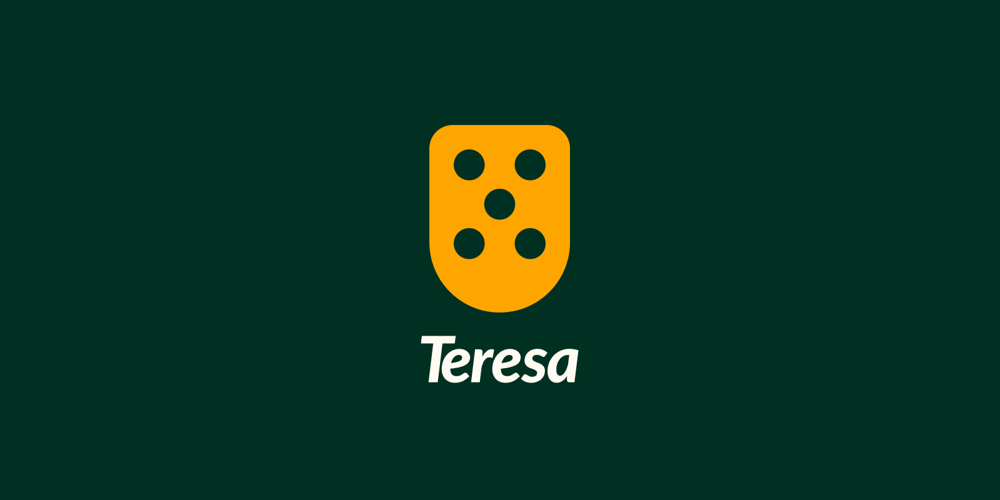

<h1 align="center">Teresa: A reusable, structured, and highly testable design system for Dart and Flutter.</h1>

<br/>
<br/>

<div align="center">
  <a href="#description">✍️ Description</a> &nbsp;&nbsp;&nbsp;|&nbsp;&nbsp;&nbsp; <a href="#installation">⬇️ Installation</a> &nbsp;&nbsp;&nbsp;|&nbsp;&nbsp;&nbsp; <a href="#testing">🧪 Testing</a> &nbsp;&nbsp;&nbsp;|&nbsp;&nbsp;&nbsp; <a href="#contact">✉️ Contact</a>
</div>

<br />
<br />

<h3 id="description">✍️ Description:</h3>

<p>Teresa is a reusable design system for Flutter applications that centralizes visual language, UI components, application configuration, navigation, orientation, and device-language handling behind a consistent API.</p>

<p>Its architecture separates reusable widgets and design tokens from the internal managers, selectors, observers, and transaction scripts responsible for keeping application state synchronized. This makes the design system easier to reuse, maintain, and test across Flutter applications.</p>

<p>Features:</p>

• <strong>Design Tokens</strong>: Provides centralized colors, typography, icon styles, and animation durations through Teresa's theme system.
<br/>
• <strong>Reusable UI Components</strong>: Ships with standardized buttons, inputs, checkboxes, navigation bars, dropdown menus, snackbars, banners, scaffolds, and other Flutter widgets.
<br/>
• <strong>Theme Support</strong>: Provides concrete light and dark theme configurations and exposes theme information throughout the widget tree.
<br/>
• <strong>Device Language Support</strong>: Provides a structured mechanism for managing and synchronizing device-language strings throughout the application.
<br/>
• <strong>Application Integration</strong>: Provides <code>TeresaApplication</code> and supporting infrastructure for integrating the design system into a Flutter application.
<br/>
• <strong>Testability</strong>: Includes abstractions and testing-oriented components such as <code>NavigatorMock</code> and <code>WidgetTestingWrapper</code>.

</p>

<br />

<h3 id="installation">⬇️ Installation:</h3>

<p>Add the following to your <code>pubspec.yaml</code>:</p>

```yaml
dev:
  teresa:
    git:
      url: "https://github.com/tupisoftwarehouse/Teresa.git"
```

<br />

<h3 id="testing">🧪 Testing:</h3>

<p>Teresa is designed with testability as part of its architecture. Its abstractions and testing utilities allow application code and UI components to be exercised without coupling every test to the complete production application environment.</p>

<p>Components such as <code>NavigatorMock</code> and <code>WidgetTestingWrapper</code> provide test-oriented infrastructure, while the separation between managers, selectors, observers, and transaction scripts keeps internal behavior organized into smaller units.</p>

<p>This makes it possible to test Teresa-based applications while maintaining the same design-system configuration and component structure used in production.</p>

<br />

<h3 id="contact">✉️ Contact:</h3>

Creator's GitHub:
<a href="https://github.com/samueldecarvalhodeveloper">https://github.com/samueldecarvalhodeveloper</a>
<br />
Tupi's email:
<a href="mailto:tupi.softwarehouse@gmail.com">tupi.softwarehouse@gmail.com</a>